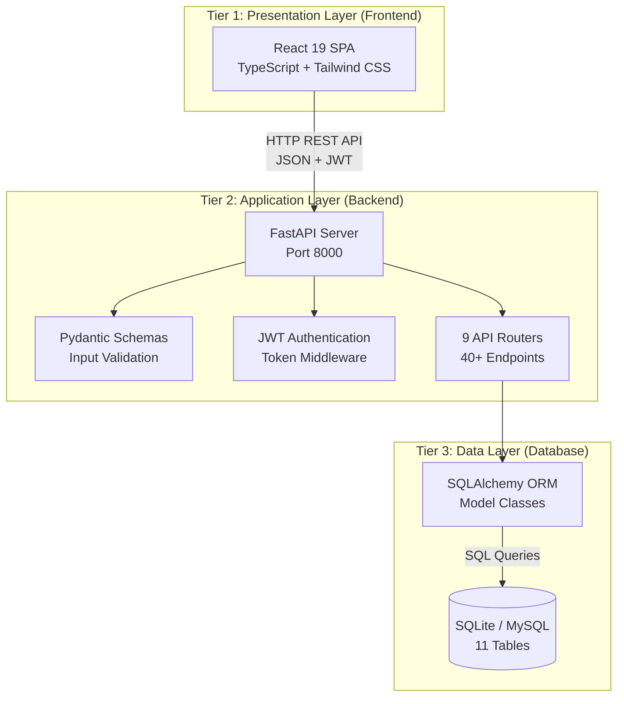
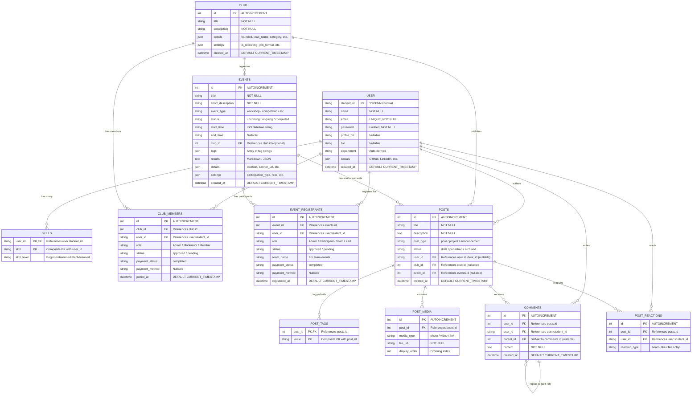
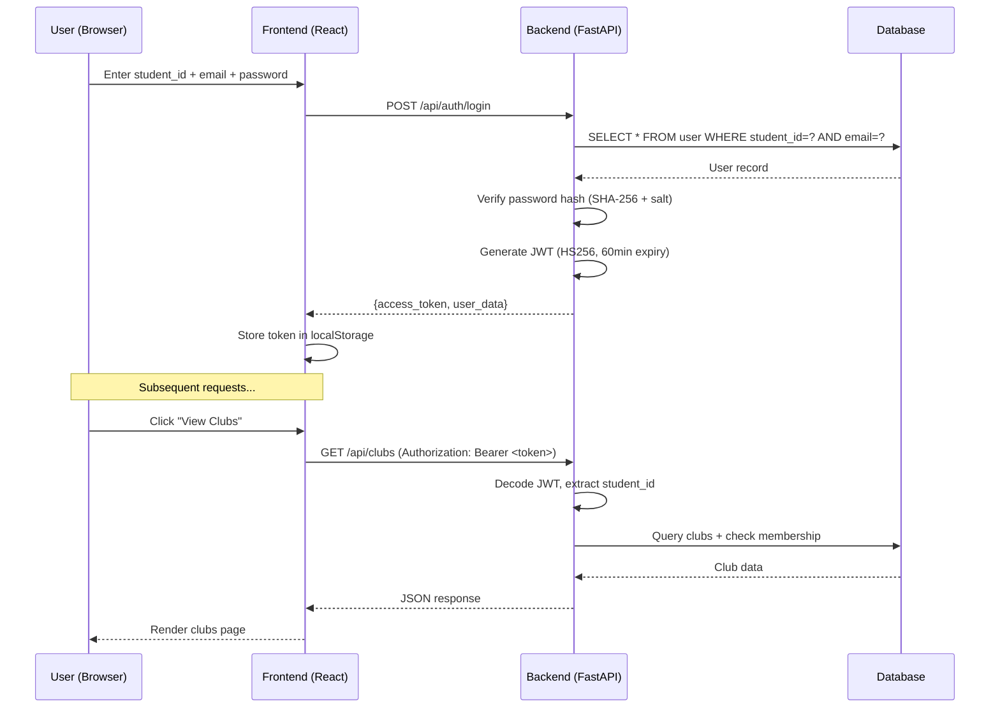

# CampusForge — Project Documentation

> **Course:** Database Management System (DBMS)  
> **Project:** CampusForge — An Academic Skills and Collaboration Platform  
> **License:** MIT — Copyright © 2026 Ashikul Islam

---

## Table of Contents

1. [Project Overview](#1-project-overview)
2. [Technology Stack](#2-technology-stack)
3. [System Architecture](#3-system-architecture)
4. [Database System (DBMS Focus)](#4-database-system-dbms-focus)
   - [4.1 Database Connection Strategy](#41-database-connection-strategy)
   - [4.2 Entity-Relationship (ER) Diagram](#42-entity-relationship-er-diagram)
   - [4.3 Table-by-Table Schema Reference](#43-table-by-table-schema-reference)
   - [4.4 Relationship Summary](#44-relationship-summary)
   - [4.5 Normalization Analysis](#45-normalization-analysis)
   - [4.6 Key SQL/DBMS Concepts Demonstrated](#46-key-sqldbms-concepts-demonstrated)
   - [4.7 ORM Mapping (SQLAlchemy)](#47-orm-mapping-sqlalchemy)
   - [4.8 Database Initialization and Seeding](#48-database-initialization-and-seeding)
5. [Authentication System](#5-authentication-system)
6. [API Endpoint Reference](#6-api-endpoint-reference)
7. [Frontend Architecture](#7-frontend-architecture)
8. [Data Flow Walkthrough](#8-data-flow-walkthrough)
9. [Email Notification System](#9-email-notification-system)
10. [Project File Structure](#10-project-file-structure)

---

## 1. Project Overview

**CampusForge** is a full-stack web application designed as a centralized platform for university students to:

- **Register and authenticate** using their university student ID
- **Create and join campus clubs** with role-based management
- **Organize and register for events** (workshops, hackathons, seminars, guest lectures)
- **Share posts, projects, and announcements** in a social feed
- **React to and comment on** content with threaded discussions
- **Manage their skills** and discover other students by skill
- **Upload files** (images, videos, documents)
- **Receive email notifications** when club or event announcements are published

The platform demonstrates a complete implementation of a relational database management system with a REST API backend and a modern single-page application frontend.

---

## 2. Technology Stack

| Layer | Technology | Purpose |
|-------|-----------|---------|
| **Backend Framework** | Python 3 + FastAPI | REST API server with automatic OpenAPI docs |
| **ORM** | SQLAlchemy 2.0 | Object-Relational Mapping for database operations |
| **Database (Dev)** | SQLite | Lightweight file-based database for development |
| **Database (Prod)** | MySQL via PyMySQL | Production-grade relational database |
| **Data Validation** | Pydantic 2.0 | Request/response schema validation |
| **Authentication** | python-jose (JWT) | JSON Web Token generation and verification |
| **Password Hashing** | hashlib (SHA-256) | Password security with salted hashing |
| **Email** | smtplib | SMTP-based email notifications |
| **Frontend Framework** | React 19 + TypeScript | Component-based single-page application |
| **Build Tool** | Vite 8 | Fast development server and production bundler |
| **CSS** | Tailwind CSS 4 | Utility-first CSS framework |
| **Icons** | Lucide React | Modern icon library |
| **Routing** | React Router DOM v7 | Client-side page routing |
| **Markdown** | react-md-editor, react-markdown | Rich text editing and rendering |
| **Data Export** | PapaParse, SheetJS | CSV and Excel file parsing/export |

---

## 3. System Architecture

The application follows a **three-tier architecture**:



**How the tiers communicate:**

1. The **Frontend** (React) sends HTTP requests to the backend API using the `fetch` API. Every authenticated request includes a JWT Bearer token in the `Authorization` header.
2. The **Backend** (FastAPI) receives requests, validates the data using Pydantic schemas, checks authentication via JWT, and processes business logic through router functions.
3. The **Database** is accessed through SQLAlchemy ORM models. The ORM translates Python object operations into SQL queries, executes them, and returns results as Python objects.

---

## 4. Database System (DBMS Focus)

This section provides a detailed analysis of the database design, which is the core focus of this DBMS course project.

### 4.1 Database Connection Strategy

The system implements a **dual-database fallback** pattern in `database.py`:

```python
def get_db_engine():
    try:
        # 1. Try MySQL first (production database)
        engine = create_engine(MYSQL_DATABASE_URL, pool_pre_ping=True)
        with engine.connect() as conn:
            pass  # Test the connection
        return engine
    except Exception:
        # 2. Fall back to SQLite (development database)
        return create_engine(
            "sqlite:///./campusforge.db",
            connect_args={"check_same_thread": False}
        )
```

**Key concepts:**

| Concept | Explanation |
|---------|-------------|
| `pool_pre_ping=True` | Before using a database connection from the pool, SQLAlchemy sends a lightweight "ping" query to verify the connection is still alive. This prevents errors from stale connections. |
| `check_same_thread=False` | SQLite normally restricts database access to the thread that created the connection. Since FastAPI handles requests across multiple threads, this flag disables that restriction. |
| `SessionLocal` | A session factory that creates new database sessions. Each API request gets its own session through the `get_db()` dependency. |
| `get_db()` yield pattern | A Python generator that creates a session, yields it for use, and ensures it is closed when the request finishes — even if an error occurs. This is a form of **resource management**. |

**Environment variables for database configuration:**

| Variable | Default | Description |
|----------|---------|-------------|
| `DATABASE_URL` | (constructed) | Full database connection string |
| `MYSQL_USER` | `root` | MySQL username |
| `MYSQL_PASSWORD` | `` | MySQL password |
| `MYSQL_HOST` | `localhost` | MySQL server address |
| `MYSQL_PORT` | `3306` | MySQL port |
| `MYSQL_DB` | `campusforge` | MySQL database name |

---

### 4.2 Entity-Relationship (ER) Diagram

The following diagram shows all 11 tables and their relationships:



---

### 4.3 Table-by-Table Schema Reference

#### Table 1: `user`

Stores all student accounts. The `student_id` follows the format **YYPPNNN** where YY is the batch year, PP is the 2-digit department code, and NNN is a 3-digit sequential number.

| Column | Data Type | Constraints | Description |
|--------|-----------|-------------|-------------|
| `student_id` | STRING(20) | **PRIMARY KEY** | 7-digit student ID (e.g., `2604001`) |
| `name` | STRING(255) | NOT NULL | Student's full name |
| `email` | STRING(255) | NOT NULL, UNIQUE | Email address |
| `password` | STRING(255) | NOT NULL | SHA-256 hashed password |
| `profile_pic` | STRING(500) | Nullable | Profile picture URL or emoji |
| `bio` | TEXT | Nullable | Short biography |
| `socials` | TEXT | Nullable | JSON string: `{"github": "...", "linkedin": "..."}` |
| `created_at` | DATETIME | DEFAULT CURRENT_TIMESTAMP | Registration timestamp |

**Department Code Mapping:**

| Code | Department |
|------|-----------|
| 01 | Civil Engineering |
| 02 | Mechanical Engineering |
| 03 | Electrical Engineering |
| 04 | Computer Science & Engineering |
| 05 | Electronics & Communication Engineering |
| 06 | Chemical Engineering |
| 07 | Architecture |
| 08 | Business Administration |
| 09 | English |
| 10 | Mathematics & Physics |

The department name is **derived at runtime** from the student_id by extracting characters at positions 2-3 and looking them up in the mapping. This avoids storing redundant data.

---

#### Table 2: `skills`

Tracks each student's technical and academic skills with proficiency levels.

| Column | Data Type | Constraints | Description |
|--------|-----------|-------------|-------------|
| `user_id` | STRING(20) | **PK (composite)**, FK → user.student_id | Owning student |
| `skill` | STRING(100) | **PK (composite)** | Skill name (e.g., "Python", "React") |
| `skill_level` | STRING(20) | NOT NULL, DEFAULT 'Beginner' | Beginner / Intermediate / Advanced |

**Key concept — Composite Primary Key:** The combination of (`user_id`, `skill`) uniquely identifies each row. This means a user cannot have duplicate skill entries, but different users can have the same skill.

**Foreign Key:** `user_id` references `user.student_id` with `ON DELETE CASCADE` — deleting a user automatically deletes all their skills.

---

#### Table 3: `club`

Stores campus club/organization information.

| Column | Data Type | Constraints | Description |
|--------|-----------|-------------|-------------|
| `id` | INTEGER | **PRIMARY KEY**, AUTOINCREMENT | Auto-generated club ID |
| `title` | STRING(255) | NOT NULL | Club name |
| `description` | TEXT | NOT NULL | Club description |
| `details` | TEXT | Nullable | JSON blob (see below) |
| `settings` | TEXT | Nullable | JSON blob (see below) |
| `created_at` | DATETIME | DEFAULT CURRENT_TIMESTAMP | Creation timestamp |

**`details` JSON structure:**
```json
{
  "founded": "2021",
  "lead_name": "Alex Rivera",
  "base_department": "Computer Science & Engineering",
  "category": "technical",
  "banner_url": "https://..."
}
```

**`settings` JSON structure:**
```json
{
  "is_recruiting": true,
  "join_format": "open",
  "membership_fee": "free",
  "is_results_public": true,
  "is_open": true,
  "payment_fee": 0
}
```

**Design Decision — JSON columns:** Configuration data that may vary widely between clubs is stored as JSON text rather than separate columns. This prevents the need for schema modifications when adding new settings and keeps the table structure clean.

---

#### Table 4: `club_members` (Junction Table)

Resolves the **many-to-many** relationship between users and clubs. A user can join multiple clubs, and a club can have multiple members.

| Column | Data Type | Constraints | Description |
|--------|-----------|-------------|-------------|
| `id` | INTEGER | **PRIMARY KEY**, AUTOINCREMENT | Membership record ID |
| `club_id` | INTEGER | NOT NULL, FK → club.id | Which club |
| `user_id` | STRING(20) | NOT NULL, FK → user.student_id | Which user |
| `role` | STRING(100) | DEFAULT 'Member' | Admin / Moderator / Member |
| `status` | STRING(50) | DEFAULT 'approved' | approved / pending |
| `payment_status` | STRING(50) | DEFAULT 'completed' | Payment tracking |
| `payment_method` | STRING | Nullable | Payment method used |
| `joined_at` | DATETIME | DEFAULT CURRENT_TIMESTAMP | When user joined |

Both foreign keys use `ON DELETE CASCADE`.

---

#### Table 5: `events`

Stores event information. Events can optionally belong to a club.

| Column | Data Type | Constraints | Description |
|--------|-----------|-------------|-------------|
| `id` | INTEGER | **PRIMARY KEY**, AUTOINCREMENT | Event ID |
| `title` | STRING(255) | NOT NULL | Event name |
| `short_description` | TEXT | NOT NULL | Brief description |
| `event_type` | STRING(50) | DEFAULT 'workshop' | workshop / competition / guest-speaker / seminar |
| `status` | STRING(50) | DEFAULT 'upcoming' | upcoming / ongoing / completed |
| `start_time` | STRING(100) | NOT NULL | ISO datetime (e.g., "2026-08-15T18:00") |
| `end_time` | STRING(100) | Nullable | ISO datetime for end |
| `club_id` | INTEGER | FK → club.id (nullable) | Hosting club (optional) |
| `tags` | TEXT | Nullable | JSON array of tag strings |
| `results` | TEXT | Nullable | Competition results (markdown/JSON) |
| `details` | TEXT | Nullable | JSON: location, banner_url, virtual_link, etc. |
| `settings` | TEXT | Nullable | JSON: participation_type, entrance_fee, etc. |
| `created_at` | DATETIME | DEFAULT CURRENT_TIMESTAMP | Creation timestamp |

**Nullable FK:** `club_id` is nullable because events can exist independently of clubs.

---

#### Table 6: `event_registrants` (Junction Table)

Resolves the **many-to-many** relationship between users and events. Supports both individual and team-based registration.

| Column | Data Type | Constraints | Description |
|--------|-----------|-------------|-------------|
| `id` | INTEGER | **PRIMARY KEY**, AUTOINCREMENT | Registration ID |
| `event_id` | INTEGER | NOT NULL, FK → events.id | Which event |
| `user_id` | STRING(20) | NOT NULL, FK → user.student_id | Which user |
| `role` | STRING(50) | DEFAULT 'Participant' | Admin / Participant / Team Lead |
| `status` | STRING(50) | DEFAULT 'approved' | approved / pending |
| `team_name` | STRING(255) | Nullable | Team name for group events |
| `payment_status` | STRING(50) | DEFAULT 'completed' | Payment tracking |
| `payment_method` | STRING | Nullable | Payment method used |
| `registered_at` | DATETIME | DEFAULT CURRENT_TIMESTAMP | Registration timestamp |

---

#### Table 7: `posts`

Central content table supporting three types of content: regular feed posts, project showcases, and announcements.

| Column | Data Type | Constraints | Description |
|--------|-----------|-------------|-------------|
| `id` | INTEGER | **PRIMARY KEY**, AUTOINCREMENT | Post ID |
| `title` | STRING(255) | NOT NULL | Post title |
| `description` | TEXT | NOT NULL | Post content (supports markdown) |
| `post_type` | STRING(50) | NOT NULL, DEFAULT 'post' | post / project / announcement |
| `status` | STRING(50) | NOT NULL, DEFAULT 'published' | draft / published / archived |
| `user_id` | STRING(20) | FK → user.student_id (nullable) | Author (student) |
| `club_id` | INTEGER | FK → club.id (nullable) | Publishing club |
| `event_id` | INTEGER | FK → events.id (nullable) | Associated event |
| `created_at` | DATETIME | DEFAULT CURRENT_TIMESTAMP | Creation time |

**Polymorphic design:** A post can belong to a user (personal), a club (club announcement), or an event (event announcement). The nullable foreign keys make this flexible.

---

#### Table 8: `post_tags`

Associates tags with posts using a **composite primary key**.

| Column | Data Type | Constraints | Description |
|--------|-----------|-------------|-------------|
| `post_id` | INTEGER | **PK (composite)**, FK → posts.id | Which post |
| `value` | STRING(100) | **PK (composite)** | Tag text (e.g., "Python", "AI") |

This design allows a post to have many tags, and the same tag value can appear on many posts (effectively a many-to-many without a separate "tags" master table).

---

#### Table 9: `post_media`

Stores media attachments (images, videos, links) for posts. A post can have **multiple** media items.

| Column | Data Type | Constraints | Description |
|--------|-----------|-------------|-------------|
| `id` | INTEGER | **PRIMARY KEY**, AUTOINCREMENT | Media ID |
| `post_id` | INTEGER | NOT NULL, FK → posts.id | Parent post |
| `media_type` | STRING(50) | NOT NULL | photo / video / link |
| `file_url` | TEXT | NOT NULL | URL or file path |
| `display_order` | INTEGER | NOT NULL, DEFAULT 0 | Display sequence |

---

#### Table 10: `comments`

Supports threaded discussions with **self-referencing foreign key** for one level of reply nesting.

| Column | Data Type | Constraints | Description |
|--------|-----------|-------------|-------------|
| `id` | INTEGER | **PRIMARY KEY**, AUTOINCREMENT | Comment ID |
| `post_id` | INTEGER | NOT NULL, FK → posts.id | Which post |
| `user_id` | STRING(20) | NOT NULL, FK → user.student_id | Comment author |
| `parent_id` | INTEGER | FK → comments.id (nullable) | Parent comment for replies |
| `content` | TEXT | NOT NULL | Comment text |
| `created_at` | DATETIME | DEFAULT CURRENT_TIMESTAMP | Comment timestamp |

**Self-referencing FK:** `parent_id` points back to the same table's `id` column:
- `parent_id = NULL` → This is a **root comment** (top-level)
- `parent_id = <some_id>` → This is a **reply** to that comment

The application enforces a **maximum depth of 1 level** (replies to replies are not allowed).

---

#### Table 11: `post_reactions`

Stores user reactions to posts with a **UNIQUE constraint** ensuring one reaction per user per post.

| Column | Data Type | Constraints | Description |
|--------|-----------|-------------|-------------|
| `id` | INTEGER | **PRIMARY KEY**, AUTOINCREMENT | Reaction ID |
| `post_id` | INTEGER | NOT NULL, FK → posts.id | Which post |
| `user_id` | STRING(20) | NOT NULL, FK → user.student_id | Who reacted |
| `reaction_type` | STRING(50) | NOT NULL, DEFAULT 'like' | heart / like / fire / clap |

**UNIQUE constraint** on `(post_id, user_id)` — A user can only have one active reaction per post. If they want to change it, the existing reaction is updated or toggled off.

---

### 4.4 Relationship Summary

| Relationship | Type | Implementation | Cardinality |
|-------------|------|---------------|-------------|
| User ↔ Skills | One-to-Many | FK in `skills` | 1 user → many skills |
| User ↔ Club | **Many-to-Many** | Junction table `club_members` | Users join multiple clubs |
| User ↔ Event | **Many-to-Many** | Junction table `event_registrants` | Users register for multiple events |
| Club → Event | One-to-Many | FK `events.club_id` | 1 club hosts many events |
| User → Post | One-to-Many | FK `posts.user_id` | 1 user writes many posts |
| Club → Post | One-to-Many | FK `posts.club_id` | 1 club publishes many posts |
| Event → Post | One-to-Many | FK `posts.event_id` | 1 event has many announcements |
| Post → Tag | One-to-Many | Composite PK in `post_tags` | 1 post has many tags |
| Post → Media | One-to-Many | FK in `post_media` | 1 post has many media items |
| Post → Comment | One-to-Many | FK in `comments` | 1 post has many comments |
| Comment → Comment | **Self-referencing** | FK `comments.parent_id` | 1 comment has many replies |
| Post → Reaction | One-to-Many | FK in `post_reactions` | 1 post receives many reactions |
| User → Comment | One-to-Many | FK in `comments` | 1 user writes many comments |
| User → Reaction | One-to-Many | FK in `post_reactions` | 1 user gives many reactions |

---

### 4.5 Normalization Analysis

The database schema follows normalization principles up to **Third Normal Form (3NF)**:

**First Normal Form (1NF):**
- ✅ All columns contain atomic (indivisible) values
- ✅ Each row is uniquely identifiable by a primary key
- ✅ No repeating groups — skills are in a separate table, not a comma-separated list in the user table

**Second Normal Form (2NF):**
- ✅ All non-key attributes are fully functionally dependent on the entire primary key
- ✅ In composite-key tables (`skills`, `post_tags`), all attributes depend on both parts of the key

**Third Normal Form (3NF):**
- ✅ No transitive dependencies — no non-key column depends on another non-key column
- ✅ `department` is derived from `student_id` at runtime rather than stored redundantly (in the ORM layer)

**Intentional denormalization — JSON columns:**
The `details` and `settings` columns in `club` and `events` store JSON blobs. This is an intentional denormalization for:
- Configuration data that changes frequently
- Optional/sparse attributes that would create many nullable columns
- Data that does not need to be queried via SQL WHERE clauses

This is a common pattern in modern applications where strict normalization would create unnecessary complexity.

---

### 4.6 Key SQL/DBMS Concepts Demonstrated

| Concept | Where Used | Explanation |
|---------|-----------|-------------|
| **Primary Key (PK)** | All 11 tables | Uniquely identifies each row. Uses auto-increment integers or composite keys. |
| **Composite Primary Key** | `skills`, `post_tags` | Two columns together form the primary key. Neither alone is unique. |
| **Foreign Key (FK)** | `club_members.club_id`, `comments.post_id`, etc. | Enforces referential integrity — ensures referenced records exist. |
| **ON DELETE CASCADE** | All FK relationships | When a parent record is deleted, all related child records are automatically deleted. Example: deleting a user removes their skills, comments, and reactions. |
| **UNIQUE Constraint** | `user.email`, `user.student_id`, `post_reactions(post_id, user_id)` | Prevents duplicate values. The composite UNIQUE on reactions prevents a user from reacting twice to the same post. |
| **Self-Referencing FK** | `comments.parent_id → comments.id` | A table that references itself to model hierarchical (tree-like) relationships — parent comments and their replies. |
| **NOT NULL Constraint** | Most columns | Prevents null values where data is required, ensuring data completeness. |
| **DEFAULT Values** | `created_at`, `status`, `role` | Provides automatic values when not explicitly specified in INSERT statements. |
| **Junction/Association Table** | `club_members`, `event_registrants` | Resolves many-to-many relationships between entities by creating an intermediary table with foreign keys to both related tables. |
| **Nullable Foreign Keys** | `events.club_id`, `posts.user_id` | Allows optional relationships. An event can exist without a club; a post can be authored by a club instead of a user. |
| **JSON in Relational DB** | `club.details`, `events.settings`, `user.socials` | Stores semi-structured data as JSON text within a relational table — a hybrid approach combining SQL and NoSQL paradigms. |
| **AUTOINCREMENT** | `user.id`, `club.id`, `events.id`, etc. | Automatically generates unique integer IDs for new rows. |
| **INDEX** | `user.student_id`, `user.email` | Speeds up queries that filter or join on these columns by creating search-optimized data structures. |

---

### 4.7 ORM Mapping (SQLAlchemy)

SQLAlchemy provides an **Object-Relational Mapping** layer that lets us interact with the database using Python objects instead of raw SQL queries.

**How each table maps to a Python class:**

| SQL Table | Python Class | Primary Key |
|-----------|-------------|-------------|
| `user` | `UserModel` | `student_id` (string) |
| `skills` | `SkillModel` | (`user_id`, `skill`) composite |
| `club` | `ClubModel` | `id` (integer) |
| `club_members` | `ClubMemberModel` | `id` (integer) |
| `events` | `EventModel` | `id` (integer) |
| `event_registrants` | `EventRegistrantModel` | `id` (integer) |
| `posts` | `PostModel` | `id` (integer) |
| `post_tags` | `PostTagModel` | (`post_id`, `value`) composite |
| `post_media` | `PostMediaModel` | `id` (integer) |
| `comments` | `CommentModel` | `id` (integer) |
| `post_reactions` | `PostReactionModel` | `id` (integer) |

**Example — How a SQL table becomes a Python class:**

```python
# SQL Table Definition:
# CREATE TABLE club (
#     id       INTEGER PRIMARY KEY AUTOINCREMENT,
#     title    TEXT NOT NULL,
#     ...
# );

# Equivalent SQLAlchemy Model:
class ClubModel(Base):
    __tablename__ = "club"
    
    id = Column(Integer, primary_key=True, autoincrement=True)
    title = Column(String(255), nullable=False)
    description = Column(Text, nullable=False)
    details = Column(Text, nullable=True)      # JSON stored as text
    settings = Column(Text, nullable=True)      # JSON stored as text
    created_at = Column(DateTime, default=datetime.utcnow)
    
    # ORM Relationships (not SQL columns — navigation shortcuts)
    members = relationship("ClubMemberModel", back_populates="club",
                          cascade="all, delete-orphan")
    events = relationship("EventModel", back_populates="club",
                         cascade="all, delete-orphan")
```

**Key ORM concepts:**

| Concept | Explanation |
|---------|-------------|
| `relationship()` | Defines a Python-level link between models. Allows navigating from one object to related objects (e.g., `club.members` returns all members). |
| `back_populates` | Creates a bidirectional link. If `ClubModel` has `members` pointing to `ClubMemberModel`, then `ClubMemberModel` has `club` pointing back. |
| `cascade="all, delete-orphan"` | When a parent is deleted, all children are automatically deleted too. "delete-orphan" also removes children if they are disconnected from their parent. |
| `ForeignKey()` | Declares the column as a foreign key in SQL, enforcing referential integrity. |

**Example — How queries work through ORM:**

```python
# Instead of raw SQL:
# SELECT * FROM club WHERE id = 1;

# We write Python:
club = db.query(ClubModel).filter(ClubModel.id == 1).first()

# And we can navigate relationships:
for member in club.members:  # SQLAlchemy auto-generates the JOIN
    print(member.user.name)
```

---

### 4.8 Database Initialization and Seeding

The `init_db.py` file handles three tasks on application startup:

1. **Table Creation:** `Base.metadata.create_all(bind=engine)` — SQLAlchemy inspects all model classes and generates `CREATE TABLE IF NOT EXISTS` statements for any missing tables.

2. **Schema Migration:** The code checks for legacy schema differences and applies lightweight migrations:
   - Adds the `event_id` column to `posts` table if missing
   - Migrates skills from a legacy JSON column in `user` to the dedicated `skills` table

3. **Seed Data:** If the database is empty (no users exist), sample data is inserted:
   - **3 Users:** Alex Rivera (CSE), Sarah Chen (Architecture), Marcus Vance (Mechanical)
   - **11 Skills** across the 3 users
   - **3 Clubs:** Google Developer Student Club, Pixel Perfect Design Club, Robotics Society
   - **4 Club Memberships** with various roles
   - **3 Events:** ByteCraft Hackathon, UI/UX Workshop, Embedded RTOS Workshop
   - **4 Event Registrations** including a team registration
   - **4 Posts** of various types (project, announcement, personal, draft)
   - **9 Tags** and **3 Media** attachments
   - **3 Comments** (including a threaded reply)
   - **4 Reactions** of different types

All seed data uses the password `password123` (hashed before storage).

---

## 5. Authentication System

The authentication system uses **JSON Web Tokens (JWT)** for stateless authentication:



**Authentication details:**

| Component | Implementation |
|-----------|---------------|
| **Password Hashing** | SHA-256 with static salt prefix `"campusforge_salt_"` |
| **Token Algorithm** | HS256 (HMAC-SHA256) |
| **Access Token Expiry** | 60 minutes (configurable) |
| **Refresh Token Expiry** | 7 days (configurable) |
| **Secret Key** | Configurable via `SECRET_KEY` env var |
| **Token Payload** | `{"sub": "<student_id>", "exp": <timestamp>}` |

**Two authentication dependencies:**
- `get_current_user()` — **Required** auth. Returns the user or raises HTTP 401 Unauthorized.
- `get_optional_current_user()` — **Optional** auth. Returns the user if authenticated, or `None` if not. Used for endpoints that work for both guests and logged-in users (e.g., viewing clubs shows "Join" button only for authenticated users).

---

## 6. API Endpoint Reference

The backend exposes **40+ REST API endpoints** organized into **9 routers**, all prefixed with `/api`:

### Authentication (`/api/auth`)

| Method | Endpoint | Auth | Description |
|--------|----------|------|-------------|
| POST | `/auth/register` | No | Create a new student account |
| POST | `/auth/login` | No | Authenticate and receive JWT tokens |
| POST | `/auth/refresh` | Yes | Renew access and refresh tokens |
| GET | `/auth/me` | Yes | Get current authenticated user profile |
| GET | `/auth/department-codes` | No | Get department code → name mapping |

### Users (`/api/users`)

| Method | Endpoint | Auth | Description |
|--------|----------|------|-------------|
| GET | `/users` | Optional | List all registered users |
| GET | `/users/{student_id}` | Optional | Get a user's profile |
| GET | `/users/{student_id}/clubs` | Optional | Get clubs the user has joined |
| GET | `/users/{student_id}/events` | Optional | Get events the user is registered for |
| PATCH | `/users/{student_id}` | Yes (owner) | Update own profile (name, bio, skills, socials) |

### Skills (`/api/skills`)

| Method | Endpoint | Auth | Description |
|--------|----------|------|-------------|
| GET | `/skills` | Optional | List all skills with student counts |
| GET | `/skills/{skill_name}` | Optional | Find all students who have a specific skill |

### Clubs (`/api/clubs`)

| Method | Endpoint | Auth | Description |
|--------|----------|------|-------------|
| GET | `/clubs` | Optional | List all clubs with member/event counts |
| GET | `/clubs/{club_id}` | Optional | Get detailed club information |
| POST | `/clubs` | Yes | Create a new club (creator becomes Admin) |
| PATCH | `/clubs/{club_id}` | Yes (admin) | Update club details and settings |
| POST | `/clubs/{club_id}/join` | Yes | Join a club (auto-approved or pending based on join_format) |
| GET | `/clubs/{club_id}/members` | Yes | List all club members with roles |
| PATCH | `/clubs/{club_id}/members/{id}` | Yes (admin) | Update member role or approval status |

### Events (`/api/events`)

| Method | Endpoint | Auth | Description |
|--------|----------|------|-------------|
| GET | `/events` | Optional | List events (filter by club, status, type) |
| GET | `/events/{event_id}` | Optional | Get event details |
| POST | `/events` | Yes | Create a new event |
| PATCH | `/events/{event_id}` | Yes (admin) | Update event details |
| POST | `/events/{event_id}/register` | Yes | Register for event (individual or team, max 4) |
| GET | `/events/{event_id}/registrants` | Yes | List all registrants and teams |
| PATCH | `/events/{event_id}/registrants/{id}` | Yes (admin) | Update registrant role/status |
| POST | `/events/{event_id}/results` | Yes (admin) | Publish competition results (sets status to completed) |
| POST | `/events/{event_id}/teams/{name}/members` | Yes | Add members to an existing team |
| POST | `/events/{event_id}/admins` | Yes (main admin) | Add co-admin with custom display role |
| DELETE | `/events/{event_id}/teams/{name}` | Yes (admin) | Remove an entire team |

### Posts (`/api/posts`)

| Method | Endpoint | Auth | Description |
|--------|----------|------|-------------|
| GET | `/posts` | Optional | List posts (filter by type, club, event, user, tag, status) |
| GET | `/posts/{post_id}` | Optional | Get a single post with reactions and comments |
| POST | `/posts` | Yes | Create a post (triggers email for announcements) |
| PATCH | `/posts/{post_id}` | Yes (author) | Update post content, tags, or media |
| PATCH | `/posts/{post_id}/publish` | Yes (author) | Change draft status to published |
| DELETE | `/posts/{post_id}` | Yes (author) | Delete a post |

### Comments (`/api/posts/{post_id}/comments`)

| Method | Endpoint | Auth | Description |
|--------|----------|------|-------------|
| GET | `/posts/{post_id}/comments` | Optional | List all comments for a post (flat list) |
| POST | `/posts/{post_id}/comments` | Yes | Add a comment or reply (max 1 nesting level) |
| PATCH | `/posts/{post_id}/comments/{id}` | Yes (author) | Edit a comment |
| DELETE | `/posts/{post_id}/comments/{id}` | Yes (author) | Delete a comment |

### Reactions (`/api/posts/{post_id}/reactions`)

| Method | Endpoint | Auth | Description |
|--------|----------|------|-------------|
| GET | `/posts/{post_id}/reactions` | No | List all reactions for a post |
| POST | `/posts/{post_id}/reactions` | Yes | Toggle reaction (same type = remove, different = switch) |
| DELETE | `/posts/{post_id}/reactions` | Yes | Remove own reaction |

### Uploads (`/api/uploads`)

| Method | Endpoint | Auth | Description |
|--------|----------|------|-------------|
| POST | `/uploads/file` | Yes | Upload a file (images, videos, docs; max 10MB; UUID-prefixed) |

---

## 7. Frontend Architecture

### Page Routing

| Route | Page Component | Description |
|-------|---------------|-------------|
| `/login` | Login | Login and registration tabs |
| `/` | Home | Dashboard with activity feed, search, and quick-access widgets |
| `/students` | Students | Student directory with department/skill filters |
| `/skills` | Skills | Skills index — browse skills across campus |
| `/skills/:skillName` | Skills | Students with a specific skill |
| `/clubs` | Clubs | Club directory with category tabs |
| `/club/:clubid` | Club | Single club page (feed, announcements, events, members, settings) |
| `/events` | Events | Event directory with type/status filters |
| `/event/:eventid` | Event | Single event page (details, results, registrants, announcements) |
| `/projects` | Projects | Project showcase feed |
| `/profile/:profileid` | Profile | User profile (own or others') |

### Key Components

| Component | Purpose |
|-----------|---------|
| `NavBar` | Top navigation with route links, theme toggle, user avatar, logout |
| `Layout` / `StyleLayout` | Page structure wrapper with navbar |
| `RequireAuth` | Route guard — redirects unauthenticated users to /login |
| `PostCard` | Rich post display: markdown, media, reactions, comments |
| `PostForm` | Post creation modal with markdown editor, tags, media |
| `Tabs` | Reusable tab component with animated indicator and count badges |
| `PaymentModal` | Payment flow for club fees and event entry fees |
| `CsvResultsUploader` | Drag-and-drop CSV/Excel parser for importing event results |
| `UserAvatar` | Profile picture with fallback to initials/icon |
| `RoleBadge` | Color-coded role indicator pill |

### API Service Layer

All backend communication is centralized in `src/services/api.ts`:
- Uses native `fetch` API (no external HTTP library)
- Base URL: `http://localhost:8000/api`
- `getAuthHeaders()` automatically injects the JWT Bearer token from `localStorage`
- Functions are organized by domain: auth, users, skills, clubs, events, posts, comments, reactions, uploads
- Data mapper functions convert backend JSON responses to frontend-friendly TypeScript shapes

### Auth Flow

1. User enters credentials on Login page
2. `POST /api/auth/login` returns JWT access token + user data
3. Token stored in `localStorage` as `campusforge-token`
4. `AuthProvider` context makes auth state available app-wide
5. On app reload, `GET /api/auth/me` validates the stored token
6. `RequireAuth` layout component redirects if unauthenticated
7. Logout clears `localStorage` and resets context state

---

## 8. Data Flow Walkthrough

**Example: A student joins a club**

This walkthrough traces the complete path data takes through all three tiers:

```
1. USER ACTION
   Student clicks "Join Club" on the Pixel Perfect Design Club page

2. FRONTEND (React)
   └─ ClubPage component calls joinClubApi(clubId)
   └─ api.ts sends: POST /api/clubs/2/join
      Headers: { Authorization: "Bearer eyJhbG..." }
      Body: {}

3. BACKEND (FastAPI Router — clubs.py)
   └─ JWT middleware extracts student_id from token
   └─ get_current_user() queries DB for the user
   └─ Router checks: Is user already a member?
      └─ SQL: SELECT * FROM club_members 
              WHERE club_id=2 AND user_id='2604001'
   └─ Router reads club settings (join_format)
      └─ If join_format="open" → status="approved"
      └─ If join_format="interview" → status="pending"
   └─ Router inserts membership record
      └─ SQL: INSERT INTO club_members 
              (club_id, user_id, role, status) 
              VALUES (2, '2604001', 'Member', 'approved')
   └─ Returns ClubResponse with updated member_count, is_joined=true

4. DATABASE
   └─ New row in club_members table:
      | id | club_id | user_id | role   | status   | joined_at           |
      | 5  | 2       | 2604001 | Member | approved | 2026-07-27 15:00:00 |

5. RESPONSE BACK TO FRONTEND
   └─ HTTP 200 with JSON: { is_joined: true, status: "approved", ... }
   └─ React re-renders: "Join" button becomes "Joined ✓"
```

---

## 9. Email Notification System

When a club or event admin creates an **announcement post**, the system optionally sends email notifications:

1. Admin creates a post with `post_type = "announcement"` and `club_id` or `event_id`
2. Backend queries the database for approved members/registrants and their email addresses
3. If SMTP is configured (via `.env`), emails are dispatched using Python's `smtplib`
4. Each recipient gets an individually addressed email with the announcement content
5. Failures are logged but do not block the announcement from being published

**Configuration (`.env` file):**
```
SMTP_HOST=smtp.example.com
SMTP_PORT=587
SMTP_USERNAME=your-username
SMTP_PASSWORD=your-password
SMTP_FROM=CampusForge <noreply@example.com>
SMTP_USE_TLS=true
```

If SMTP is not configured, the system still works — announcements are published normally, but no emails are sent.

---

## 10. Project File Structure

```
CampusForge/
├── backend/                          # Python FastAPI Application
│   ├── main.py                       # App entry point, CORS, router registration
│   ├── database.py                   # DB engine creation, session management
│   ├── models.py                     # 11 SQLAlchemy ORM model classes
│   ├── schemas.py                    # Pydantic validation/serialization schemas
│   ├── auth.py                       # JWT token creation, password hashing, auth deps
│   ├── init_db.py                    # Table creation, migration, seed data
│   ├── email_notifications.py        # SMTP email delivery for announcements
│   ├── schema.sql                    # Reference SQL schema (SQLite dialect)
│   ├── schema_mysql.sql              # Reference SQL schema (MySQL dialect)
│   ├── standalone_server.py          # Zero-dependency fallback server
│   ├── requirements.txt              # Python package dependencies
│   ├── .env.example                  # SMTP configuration template
│   └── routers/                      # API endpoint modules
│       ├── auth.py                   # /auth — register, login, refresh, me
│       ├── users.py                  # /users — profiles, user clubs/events
│       ├── skills.py                 # /skills — skill directory, search
│       ├── clubs.py                  # /clubs — CRUD, join, member management
│       ├── events.py                 # /events — CRUD, register, teams, results
│       ├── posts.py                  # /posts — feed, projects, announcements
│       ├── comments.py               # /comments — threaded discussions
│       ├── reactions.py              # /reactions — heart, like, fire, clap
│       └── uploads.py                # /uploads — file upload handler
│
├── frontend/                         # React TypeScript Application
│   ├── src/
│   │   ├── App.tsx                   # Root component, routing, context providers
│   │   ├── pages/                    # Page-level components (10 pages)
│   │   ├── components/               # Reusable UI components
│   │   ├── services/api.ts           # Backend API integration layer
│   │   └── context/                  # AuthContext, ThemeContext
│   ├── package.json                  # Node.js dependencies
│   ├── vite.config.ts                # Vite build configuration
│   └── index.html                    # SPA entry HTML
│
├── start.sh                          # One-click startup script (both servers)
├── README.md                         # Project overview and setup guide
└── LICENSE                           # MIT License
```

---

*End of Documentation*
